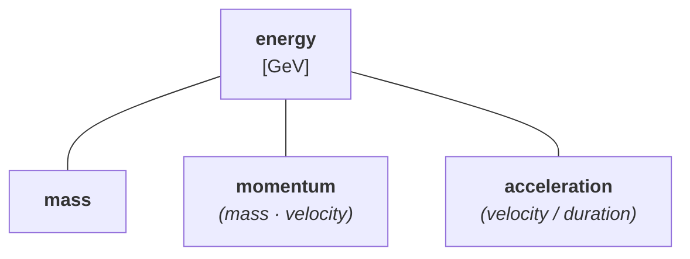
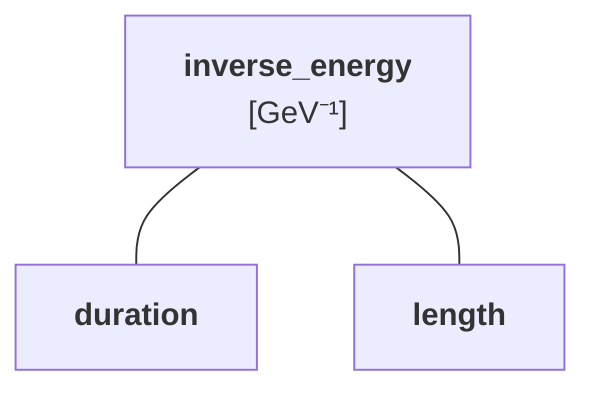
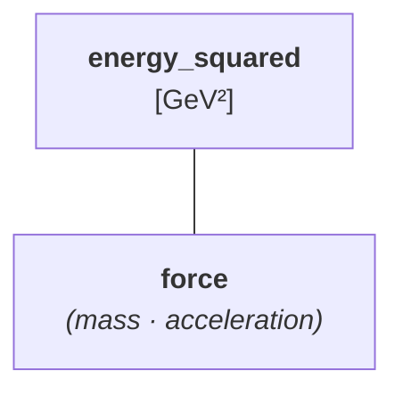
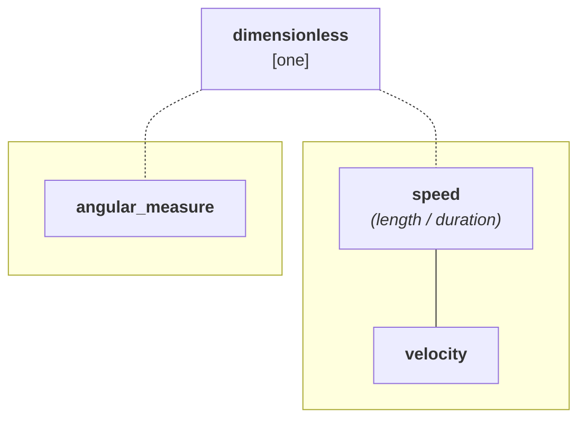

# Natural Units

**Natural units** are systems of measurement commonly used in theoretical physics where certain
physical constants are set to dimensionless 1. This simplifies calculations by eliminating
conversion factors while maintaining dimensional correctness.

There are [many different natural unit systems](https://en.wikipedia.org/wiki/Natural_units),
each suited to different areas of physics:

- **Particle physics natural units**: $\hbar = c = 1$, using electronvolts (eV) for _energy_
- **Planck units**: $\hbar = c = G = k_\textsf{B} = 1$, fundamental for _quantum gravity_
- **Stoney units**: $e = c = G = k_\textsf{e} = 1$, based on _electric charge_
- **Atomic units**: $\hbar = m_\textsf{e} = e = k_\textsf{e} = 1$, convenient for atomic
  and molecular physics
- **Geometrized units**: $c = G = 1$, used in general relativity

The choice of which constants to set to 1 depends on the problem domain. For example, particle
physicists typically keep kB explicit since they rarely deal with _temperature_, while
cosmologists might include it.

**mp-units** provides a natural units system based on **particle physics conventions** where
$\hbar = c = 1$ and _energy_ is expressed in gigaelectronvolts (GeV). This matches the conventions
used by the [Particle Data Group (PDG)](https://pdg.lbl.gov) and standard high-energy physics
textbooks. Thermal quantities are out of scope for this system — _temperature_ is not modeled,
which is the norm in particle physics where it rarely appears.


## Core Principle

In natural units, physical constants like c and ℏ are not "converted to 1" - rather, we choose
a system of quantities and units where these constants are **dimensionless and equal to 1**.
This fundamentally changes how we express physical relationships.

!!! tip "See also"

    The general technique of choosing units to eliminate physical constants is called
    **nondimensionalization**. For a broader treatment of this concept and its application
    in **mp-units**, see the
    [Nondimensionalization](../../how_to_guides/advanced_usage/nondimensionalization.md)
    How-To Guide.

In SI units with explicit constants:

- Energy-mass relation: $E = mc^2$
- Energy-momentum relation (massless): $E = pc$
- Energy-time uncertainty: $\Delta E \cdot \Delta t \geq \hbar/2$

In natural units where $c = 1$ and $\hbar = 1$:

- Energy-mass relation: $E = m$ (_mass_ IS _energy_)
- Energy-momentum relation: $E = p$ (_momentum_ IS _energy_)
- Energy-time uncertainty: $\Delta E \cdot \Delta t \geq 1/2$ (_duration_ has dimension $1/\text{energy}$)

## Quantity Hierarchy

The **mp-units** natural units system uses a quantity specification hierarchy that provides
type safety while respecting the physics of natural units. Quantities with a defining equation
are annotated in _italics_; quantities marked with `is_kind` form independent sub-hierarchies.

The four dimension groups and their rules are described below.

### Energy Dimension



`mass` is a child of `energy` — it IS energy, just a more specific kind. Functions accepting
`energy` will accept `mass` implicitly, but functions accepting `mass` will reject
raw `energy` (requires explicit conversion). `momentum` and `acceleration` also live here
via their defining equations ($E_0 = mc^2$ → with $c = 1$: $m = E$; $p = mv$; $a = dv/dt$).

### Inverse Energy Dimension



`duration` and `length` are siblings under `inverse_energy` — neither is a subtype of the other.
`duration` follows from $\tau = \hbar/\Gamma$ → with $\hbar = 1$: $\tau = 1/\Gamma$; `length`
from $\bar{\lambda} = \hbar/(mc)$ → with $\hbar = c = 1$: $l = 1/E$. Converting between
them requires `quantity_cast`, not an implicit conversion.

### Energy Squared Dimension



`force` is the only quantity in the GeV² hierarchy, derived via $F = ma$.

### Dimensionless Quantities



_Velocities_ and _angles_ are dimensionless, but they are **separate quantity kinds**
— the `is_kind` marker prevents implicit cross-conversion between them. The dashed arrows
denote subkinds — crossing the kind boundary requires an explicit conversion. Quantities
from different `is_kind` roots (`speed` and `angular_measure`) cannot be converted to
each other at all.

## Dimensional Relationships

Key relationships between SI and natural units ($c = \hbar = 1$):

| SI Relationship         | Natural Units      | Dimension |
|-------------------------|--------------------|-----------|
| $E = mc^2$              | $E = m$            | $E$       |
| $p = E/c$ (massless)    | $p = E$            | $E$       |
| $E = pc$ (massless)     | $E = p$            | $E$       |
| $\tau = \hbar/\Gamma$   | $\tau = 1/\Gamma$  | $E^{-1}$  |
| $\lambda = 2\pi\hbar/p$ | $\lambda = 2\pi/p$ | $E^{-1}$  |
| $v = \beta c$           | $v = \beta$        | $1$       |
| $F = ma$                | $F = ma$           | $E^2$     |


## Units

The system uses electronvolt as the base unit:

```cpp
namespace mp_units::natural {

// Base unit for energy
inline constexpr struct electronvolt : named_unit<"eV", kind_of<energy>> {} electronvolt;

// Scaled to GeV for particle physics
inline constexpr auto gigaelectronvolt = si::giga<electronvolt>;

}
```

### Constants

```cpp
namespace mp_units::natural {

// Speed of light is dimensionless 1 in natural units (c = 1)
inline constexpr struct speed_of_light_in_vacuum : named_constant<"c", one> {} speed_of_light_in_vacuum;

}
```

### Unit Symbols

```cpp
namespace mp_units::natural::unit_symbols {

inline constexpr auto GeV  = gigaelectronvolt;
inline constexpr auto GeV2 = square(gigaelectronvolt);
inline constexpr auto c    = speed_of_light_in_vacuum;

}
```

## Usage Examples

### Basic Quantities

```cpp
using namespace mp_units::natural;
using namespace mp_units::natural::unit_symbols;

// Mass (rest energy)
quantity proton_mass = mass(0.938 * GeV);
quantity electron_mass = mass(0.511e-3 * GeV);

// Momentum
quantity photon_momentum = momentum(10. * GeV);

// Duration (e.g. Z boson lifetime, Γ_Z = 2.495 GeV)
quantity z_lifetime = duration(1. / (2.495 * GeV));  // ~2.6×10⁻²⁵ s

// Length (e.g. proton charge radius ≈ 4.5 GeV⁻¹)
quantity proton_radius = length(4.5 / GeV);  // ≈ 0.88 fm

// Velocity (dimensionless, β = v/c)
quantity beta = velocity(0.99);
```

### Relativistic Energy-Momentum

The energy-momentum relation simplifies dramatically:

```cpp
// Calculate total energy from momentum and mass
QuantityOf<natural::energy> auto calc_energy(QuantityOf<natural::momentum> auto p,
                                             QuantityOf<natural::mass> auto m)
{
  return natural::energy(hypot(p, m));
}

// With c = 1, this becomes: E = sqrt(p² + m²)
quantity p = momentum(4. * GeV);
quantity m = mass(3. * GeV);
quantity E = calc_energy(p, m);  // = 5 GeV
```

### Decay Widths and Lifetimes

Decay widths (Γ) and lifetimes (τ) are simply related by τ = 1/Γ:

```cpp
// Top quark (very short-lived, Γ = 1.42 GeV)
quantity top_width = energy(1.42 * GeV);
quantity top_lifetime = duration(1. / top_width);  // ~5×10⁻²⁵ s

// Muon (relatively long-lived, Γ = 3×10⁻¹⁹ GeV)
quantity muon_width = energy(2.996e-19 * GeV);
quantity muon_lifetime = duration(1. / muon_width);  // ~2.2 μs
```

### Type Safety in Action

The quantity hierarchy prevents common errors. There are two ways to constrain function parameters:

**Non-template** — fixes the unit and representation; the quantity-spec form adds a kind constraint:

```cpp
void process(quantity<GeV, double> e)                    { /* accepts any quantity of energy kind */ }
void process(quantity<energy[GeV], double> e)            { /* energy, mass, momentum, acceleration */ }
void process(quantity<mass[GeV], double> m)              { /* only mass */ }

void process(quantity<inverse(GeV), double> x)           { /* any inverse-energy quantity */ }
void process(quantity<duration[inverse(GeV)], double> t) { /* only duration */ }

void process(quantity<one, double> x)                    { /* any dimensionless: speed, velocity, angular_measure */ }
void process(quantity<speed[one], double> v)             { /* speed and velocity (not angular_measure) */ }
```

**Template** — accepts any unit and representation of the right kind:

```cpp
void process(QuantityOf<energy> auto e)         { /* energy, mass, momentum, acceleration */ }
void process(QuantityOf<mass> auto m)           { /* only mass */ }
void process(QuantityOf<inverse_energy> auto x) { /* duration, length */ }
void process(QuantityOf<duration> auto t)       { /* only duration */ }
void process(QuantityOf<speed> auto v)          { /* accepts speed, velocity (not angular_measure) */ }
```

For example:

```cpp
void compute_rest_energy(QuantityOf<mass> auto m)
{
  quantity E0 = m;
  // ...
}

quantity m = mass(0.938 * GeV);
quantity p = momentum(3. * GeV);

compute_rest_energy(m);      // ✓ OK
// compute_rest_energy(p);   // ✗ Compile-time error: momentum is not mass

// But you can explicitly convert if you know what you're doing
compute_rest_energy(quantity_cast<mass>(p));  // ✓ Explicit cast OK
```


## Converting from Natural to SI

Since natural units form a system of quantities incompatible with ISQ, there is no automatic
unit conversion. Instead, extract the numerical value and apply the appropriate physical
constant using SI defining constants from `constants.h`. The optional template parameter `To`
selects the output unit (defaulting to the SI base unit); the `UnitOf<isq::...>` constraint
rejects incompatible units at compile time:

```cpp
template<UnitOf<isq::duration> auto To = si::second>
quantity<To> to_isq(QuantityOf<natural::duration> auto t)
{
  // Time: τ_SI [s] = τ_nat [GeV⁻¹] × ℏ [GeV·s]
  constexpr double hbar = (1.0 * si::reduced_planck_constant).numerical_value_in(si::giga<si::electronvolt> * To);
  return t.numerical_value_in(one / natural::gigaelectronvolt) * hbar * To;
}

template<UnitOf<isq::length> auto To = si::metre>
quantity<To> to_isq(QuantityOf<natural::length> auto l)
{
  // Length: l_SI [m] = l_nat [GeV⁻¹] × ℏc [GeV·m]
  constexpr double hbarc = (1.0 * si::reduced_planck_constant * si::speed_of_light_in_vacuum)
                             .numerical_value_in(si::giga<si::electronvolt> * To);
  return l.numerical_value_in(one / natural::gigaelectronvolt) * hbarc * To;
}

using namespace mp_units::natural::unit_symbols;

std::cout << "1 GeV⁻¹ = " << to_isq(natural::duration(1. / GeV)) << '\n';                     // 1 GeV⁻¹ = 6.58212e-25 s
std::cout << "1 GeV⁻¹ = " << to_isq<si::femto<si::metre>>(natural::length(1. / GeV)) << '\n'; // 1 GeV⁻¹ = 0.197327 fm
std::cout << "1 GeV⁻¹ = " << to_isq(natural::length(1. / GeV)) << '\n';                       // 1 GeV⁻¹ = 1.97327e-16 m
```

Standard conversion factors between natural and SI units:

| Quantity | Natural unit         | SI equivalent                          |
|----------|----------------------|----------------------------------------|
| energy   | $1\,\text{GeV}$      | $1.602 \times 10^{-10}\,\text{J}$      |
| mass     | $1\,\text{GeV}$      | $1.783 \times 10^{-27}\,\text{kg}$     |
| momentum | $1\,\text{GeV}$      | $5.344 \times 10^{-19}\,\text{kg·m/s}$ |
| duration | $1\,\text{GeV}^{-1}$ | $6.582 \times 10^{-25}\,\text{s}$      |
| length   | $1\,\text{GeV}^{-1}$ | $1.973 \times 10^{-16}\,\text{m}$      |
| area     | $1\,\text{GeV}^{-2}$ | $3.894 \times 10^{-32}\,\text{m}^2$    |
| velocity | $1$                  | $2.998 \times 10^{8}\,\text{m/s}$      |

## Comparison with SI Units

The same energy-momentum calculation in both systems:

=== "Natural Units"

    ```cpp
    using namespace mp_units;
    using namespace mp_units::natural::unit_symbols;

    quantity p = natural::momentum(4. * GeV);
    quantity m = natural::mass(3. * GeV);

    // Simple formula: E = hypot(p, m)
    quantity E = natural::energy(hypot(p, m));

    std::cout << "E = " << E << "\n";  // E = 5 GeV
    ```

=== "SI Units"

    ```cpp
    using namespace mp_units;
    using namespace mp_units::si::unit_symbols;

    constexpr Unit auto GeV = si::giga<si::electronvolt>;
    constexpr auto c = si::si2019::speed_of_light_in_vacuum;

    quantity p = isq::momentum(4. * GeV / c);
    quantity m = isq::mass(3. * GeV / pow<2>(c));

    // c is a named_constant — it cancels symbolically, so this reduces to hypot(4 GeV, 3 GeV)
    quantity E = isq::energy(hypot(p * c, m * pow<2>(c)));

    std::cout << "E = " << E.in(GeV) << "\n";  // E = 5 GeV
    ```

Because `c` is a `named_constant`, the `c` factors cancel at compile time and no
floating-point multiplication by the speed of light occurs. The natural units version
is still clearer — there are no factors to write at all — but the SI version is not
as costly as it looks.

## Advantages

1. **Simplified formulas**: Match theoretical physics notation exactly
2. **Clearer physics**: Relationships like E = m are direct, not hidden in conversion factors
3. **Type safety**: Quantity hierarchy prevents mixing incompatible concepts
4. **Natural scales**: Quantities are expressed in units natural to the problem
5. **Dimensional checking**: Unit dimensions still verified at compile time

## Limitations

1. **Not ISQ-compatible**: Cannot use ISQ quantity types (`isq::mass`, `isq::momentum`, etc.)
2. **Domain-specific**: Best suited for particle physics; less intuitive for other domains
3. **Conversion overhead**: Converting back to SI cannot use the quantity conversion
   system — it requires helper functions that apply physical constants to raw numerical
   values
4. **Learning curve**: Requires understanding of natural unit conventions
5. **Mechanics only**: The quantity hierarchy covers _energy_, _mass_, _momentum_, _force_,
   _acceleration_, _length_, _time_, and _velocity_. Other domains (e.g., electromagnetism,
   thermodynamics) are not modeled

## Best Practices

1. **Use quantity specs**: Always use `mass()`, `momentum()`, `duration()` specifiers
   for clarity
2. **Convert at boundaries**: Keep natural units internal, convert to/from SI at interfaces
   (if required)
3. **Type-safe functions**: Use `QuantityOf<natural::mass> auto` (template) or
   `quantity<natural::mass[GeV], double>` (non-template) to constrain function parameters

## See Also

- [SI Units](si.md) - Standard International System
- [Quantity Specifications](../framework_basics/systems_of_quantities.md) - Understanding
  quantity hierarchies
- [Natural Units (Wikipedia)](https://en.wikipedia.org/wiki/Natural_units)
- [Particle Data Group](https://pdg.lbl.gov) - Standard conventions for particle physics
- [Natural Systems Reference](../../reference/systems_reference/systems/natural.md) - Complete
  list of units
