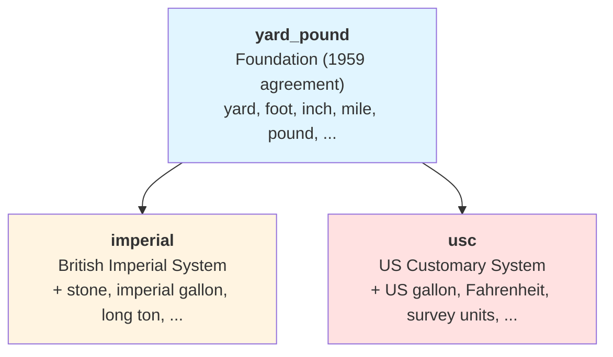

# Yard-Pound Systems

## Overview

The **Yard-Pound** systems encompass a family of related measurement systems primarily used
in the United States and, historically, throughout the British Commonwealth. Unlike the
coherent SI system, these systems evolved organically over centuries, leading to regional
variations and unit definitions that differ between countries.

!!! info

    For a general introduction to systems of units and how they relate to systems of
    quantities, see [Systems of Units](../framework_basics/systems_of_units.md) in the
    Framework Basics section.


## Historical Context: The 1959 Agreement

Prior to 1959, the definitions of the yard and pound varied slightly between English-speaking
countries. To address this inconsistency, the **International Yard and Pound Agreement** was
signed in 1959 between the United States, United Kingdom, Canada, Australia, New Zealand, and
South Africa. This agreement standardized the following base units:

- **1 international yard** = 0.9144 metres (exactly)
- **1 international pound** = 0.45359237 kilograms (exactly)

These standardized definitions form the foundation of all modern yard-pound measurements.

!!! note "Historical Name"

    The term "international" in "international yard and pound" refers to the 1959
    international agreement that standardized these units between countries, not to be
    confused with the International System of Units (SI). In **mp-units**, we use the
    term "yard-pound" to avoid confusion with SI.


## Library Architecture

**mp-units** provides three related namespaces that reflect the historical and regional
evolution of these measurement systems:



### Header Files

```cpp
#include <mp-units/systems/yard_pound.h>  // Foundation units (1959 agreement)
#include <mp-units/systems/imperial.h>    // British Imperial extensions
#include <mp-units/systems/usc.h>         // US Customary extensions
```

!!! tip "Include What You Need"

    Only include the headers for the systems you actually use. If you're working solely
    with US measurements, include only `usc.h`. This reduces compile times and makes
    namespace collisions less likely.

### `mp_units::yard_pound` - Foundation System

The `yard_pound` namespace contains the base units defined by the 1959 international agreement
and units derived from them that are common across all yard-pound systems:

```cpp
#include <mp-units/systems/yard_pound.h>

using namespace mp_units;
using namespace mp_units::yard_pound::unit_symbols;

// Length units
quantity length = 5 * yd;
quantity distance = 100 * ft;
quantity tiny = 3 * in;
quantity road_distance = 50 * mi;

// Mass/force units
quantity mass = 10 * lb;
quantity force = 150 * pdl;

// Speed units
quantity ship_speed = 20 * kn;
quantity vehicle_speed = 65 * mph;
```

**Key units in this namespace:**

| Unit          | Symbol | Quantity | Definition                    |
|---------------|--------|----------|-------------------------------|
| yard          | yd     | _length_ | 0.9144 m (by definition)      |
| foot          | ft     | _length_ | 1/3 yd                        |
| inch          | in     | _length_ | 1/36 yd                       |
| mile          | mi     | _length_ | 1760 yd                       |
| nautical mile | nmi    | _length_ | 1852 m                        |
| pound         | lb     | _mass_   | 0.45359237 kg (by definition) |
| poundal       | pdl    | _force_  | lb⋅ft/s²                      |
| knot          | kn     | _speed_  | nmi/h                         |

### `mp_units::imperial` - British Imperial System

The `imperial` namespace extends `yard_pound` with units specific to the British Imperial
system, which remained the official system in the United Kingdom until metrication began
in 1965:

```cpp
#include <mp-units/systems/imperial.h>

using namespace mp_units;
using namespace mp_units::imperial::unit_symbols;

// Imperial-specific units
quantity volume = 5 * gal;                    // Imperial gallon (≈ 4.546 L)
quantity weight = 12 * st;                    // Stone (14 lb)
quantity heavy_mass = 2 * imperial::long_ton; // Long ton (2240 lb)
```

**Key imperial-specific units:**

| Unit               | Symbol | Quantity | Definition   | Notes                      |
|--------------------|--------|----------|--------------|----------------------------|
| stone              | st     | _mass_   | 14 lb        | UK personal weight         |
| long ton           | —      | _mass_   | 2240 lb      | Also called "imperial ton" |
| long hundredweight | cwt    | _mass_   | 112 lb       | UK commerce                |
| imperial gallon    | gal    | _volume_ | 4.54609 L    | Different from US gallon   |
| imperial pint      | pt     | _volume_ | 1/8 imp. gal | 568.261 mL                 |

### `mp_units::usc` - US Customary System

The `usc` namespace extends `yard_pound` with units specific to the United States Customary
system, which remains the primary system for everyday use in the United States:

```cpp
#include <mp-units/systems/usc.h>

using namespace mp_units;
using namespace mp_units::usc::unit_symbols;

// US-specific units
quantity volume = 5 * gal;                                    // US liquid gallon (≈ 3.785 L)
quantity_point temp = point<deg_F>(72);                       // Fahrenheit temperature
quantity land_dist = 1000 * usc::survey1893::us_survey_foot;  // Deprecated US survey foot
quantity shipping = 3 * usc::short_ton;                       // Short ton (2000 lb)
```

**Key US-specific units:**

| Unit                  | Symbol | Quantity      | Definition      | Notes                   |
|-----------------------|--------|---------------|-----------------|-------------------------|
| short ton             | —      | _mass_        | 2000 lb         | Standard US ton         |
| short hundredweight   | cwt    | _mass_        | 100 lb          | US commerce             |
| US liquid gallon      | gal    | _volume_      | 3.785411784 L   | Different from imperial |
| US liquid pint        | pt     | _volume_      | 1/8 US gal      | 473.176 mL              |
| US dry gallon         | —      | _volume_      | 4.40488377086 L | For dry goods           |
| Fahrenheit            | °F     | _temperature_ | (x−32)×5/9 K    | °F = °C × 9/5 + 32      |
| US survey foot (1893) | ft(us) | _length_      | 1200/3937 m     | Deprecated since 2023   |
| US survey mile (1893) | mi(us) | _length_      | 5280 survey ft  | Deprecated since 2023   |


## Critical Differences and Pitfalls

### The Gallon Problem

!!! danger "Different Gallons!"

    The **imperial gallon** (≈ 4.546 L) and **US gallon** (≈ 3.785 L) differ by about
    **20%**. Using the wrong one can lead to significant errors in calculations involving
    fuel consumption, tank capacities, or fluid volumes.

```cpp
#include <mp-units/systems/imperial.h>
#include <mp-units/systems/usc.h>

using namespace mp_units;

quantity uk_tank = 15 * imperial::gallon;    // ≈ 68.2 liters
quantity us_tank = 15 * usc::gallon;         // ≈ 56.8 liters - 20% less!
quantity total_volume = uk_tank + us_tank;   // Correctly converts and adds both volumes
```

### Tons: Short, Long, and Metric

!!! warning "Three Different Tons"

    The word "ton" can refer to three completely different measurements:

    - **Short ton** (US): 2000 lb ≈ 907 kg - called simply "ton" in the United States
    - **Long ton** (UK): 2240 lb ≈ 1016 kg - called simply "ton" in the United Kingdom
    - **Metric ton** (SI): 1000 kg = 2204.6 lb - also called "tonne"

    **Regional Usage:** In everyday speech, people in the UK say "ton" (meaning 2240 lb),
    while people in the US say "ton" (meaning 2000 lb). The qualifiers "long" and "short"
    are international technical terms used for disambiguation between regions.

    **In mp-units:** Each system defines `ton` as its regional default:

    ```cpp
    using namespace mp_units;

    // UK usage - "ton" means long ton (2240 lb)
    quantity uk_cargo = 5 * imperial::ton;        // 2240 lb each
    quantity uk_cargo2 = 5 * imperial::long_ton;  // Same thing (alias)

    // US usage - "ton" means short ton (2000 lb)
    quantity us_cargo = 5 * usc::ton;             // 2000 lb each
    quantity us_cargo2 = 5 * usc::short_ton;      // Same thing (alias)

    // Metric ton is different from both
    quantity metric_cargo = 5 * si::tonne;        // 1000 kg each
    ```

    When working with both systems, use namespace qualification to be explicit:
    `imperial::ton` vs `usc::ton` vs `si::tonne`.

### US Survey Units

!!! warning "Survey Units Deprecated"

    In accordance with **NIST SP 811**, as of January 1, 2023, the use of the U.S. survey
    foot and U.S. survey mile is **deprecated**. The international foot (0.3048 m exactly)
    should be used for all applications.

    However, **mp-units** still provides these units in the `usc::survey1893` namespace
    for legacy data and historical calculations.

**Historical Context:**

Before the 1959 International Yard and Pound Agreement, the United States used a slightly
different definition of the foot for surveying:

- **International foot** (1959-present): 0.3048 m (exactly)
- **US survey foot** (1893-2022): 1200/3937 m ≈ 0.30480061 m

While the difference is only about **2 parts per million** (~0.6 mm per foot), it accumulates
over large distances. A 10-mile survey using the wrong foot would be off by about 1 inch!

**Library Structure:**

**mp-units** provides three sets of _length_ units in the `usc` namespace:

1. **Modern units** (top-level): Based on international foot - use these for new work
    - `usc::foot`
    - `usc::mile`
    - `usc::link`
    - `usc::chain`
    - `usc::furlong`

2. **Deprecated survey units** (top-level): Legacy survey units with deprecation warnings
    - `usc::us_survey_foot` (marked `[[deprecated]]`)
    - `usc::us_survey_mile` (marked `[[deprecated]]`)

3. **Historical survey units** (`survey1893` namespace): Complete set for legacy calculations
    - `usc::survey1893::us_survey_foot`
    - `usc::survey1893::link`
    - `usc::survey1893::chain`
    - `usc::survey1893::furlong`
    - `usc::survey1893::us_survey_mile`
    - `usc::survey1893::league`

!!! note "Acre Definition"

    The US `acre` is defined based on the survey chain (`usc::survey1893::chain`), as
    historically acres were measured using survey equipment. This maintains consistency
    with historical land records.

**Code Example:**

```cpp
using namespace mp_units;

// Modern international units (recommended)
quantity modern_mile = 5280 * yard_pound::foot;  // 1609.344 m exactly
quantity plot_width = 100 * usc::foot;           // Uses international foot

// Legacy survey units (for historical data only)
quantity old_survey = 5280 * usc::survey1893::us_survey_foot;  // 1609.347 m
quantity land_area = 1 * usc::acre;  // Based on survey chain

// Difference is small but accumulates:
// modern_mile - old_survey ≈ 3 mm per mile
// Over 100 miles: ~30 cm difference!
```

**When to Use Which:**

- **Modern applications**: Use `yard_pound::foot`, `yard_pound::mile`, or `usc::foot`, `usc::mile`
- **Legacy survey data** (pre-2023): Use `usc::survey1893::us_survey_foot` and related units
- **Land area calculations**: `usc::acre` is correctly defined using survey chain
- **New surveys** (post-2023): Must use international foot per NIST SP 811


## Best Practices

### Namespace Selection

Choose your namespace based on your application domain:

```cpp
// ✅ For general calculations with international standardized units:
#include <mp-units/systems/yard_pound.h>
using namespace mp_units;
quantity distance = 100 * yard_pound::mile;

// ✅ For UK-specific applications (recipes, historical data):
#include <mp-units/systems/imperial.h>
using namespace mp_units;
quantity volume = 2 * imperial::gallon;

// ✅ For US-specific applications (engineering, everyday use):
#include <mp-units/systems/usc.h>
using namespace mp_units;
quantity tank_size = 15 * usc::gallon;
quantity temperature = point<usc::degree_Fahrenheit>(72);
```

### Avoiding Name Conflicts

!!! danger "Don't Mix Namespaces Carelessly"

    Bringing multiple yard-pound system namespaces into scope simultaneously can lead
    to ambiguity:

    ```cpp
    // ❌ BAD: Ambiguous which gallon!
    using namespace mp_units::imperial::unit_symbols;
    using namespace mp_units::usc::unit_symbols;
    quantity volume = 5 * gal;  // Compile error: ambiguous!
    ```

    **Solution:** Use explicit qualification:

    ```cpp
    // ✅ GOOD: Explicit qualification
    using namespace mp_units;
    quantity uk_volume = 5 * imperial::gallon;
    quantity us_volume = 5 * usc::gallon;

    // ✅ GOOD: With namespace aliases for brevity
    using namespace mp_units;
    namespace imp = imperial;
    namespace us = usc;
    quantity uk_volume = 5 * imp::gallon;
    quantity us_volume = 5 * us::gallon;
    ```

### Safe Unit Conversions

Traditional approaches to unit conversions often rely on manual conversion factors, which can
lead to errors when dealing with similar but different units (like imperial vs US gallons).

=== "Traditional Approach ❌"

    ```cpp
    // Unsafe: Manual conversion factors
    constexpr double GALLON_TO_LITRE = 3.785411784;  // Which gallon?!

    double uk_tank_gallons = 15.0;
    double us_tank_gallons = 15.0;

    // ERROR: Using US conversion factor for UK gallon!
    double uk_tank_litres = uk_tank_gallons * GALLON_TO_LITRE;  // WRONG!
    double us_tank_litres = us_tank_gallons * GALLON_TO_LITRE;  // OK

    // 68.2 L stored as 56.8 L - 20% error goes undetected!
    double total = uk_tank_litres + us_tank_litres;
    ```

=== "mp-units Approach ✅"

    ```cpp
    #include <mp-units/systems/imperial.h>
    #include <mp-units/systems/usc.h>
    #include <mp-units/systems/si.h>

    using namespace mp_units;

    quantity uk_tank = 15.0 * imperial::gallon;
    quantity us_tank = 15.0 * usc::gallon;

    quantity total = (uk_tank + us_tank).in(si::litre); // 125.0 L - correct!
    ```

The library ensures that each unit uses its correct conversion factor, eliminating an entire
class of calculation errors common in manual unit handling.


## Relationship with ISQ

Like other systems in **mp-units**, the yard-pound systems can be used with quantities
from the [International System of Quantities (ISQ)](isq.md):

```cpp
#include <mp-units/systems/isq.h>
#include <mp-units/systems/yard_pound.h>

using namespace mp_units;
using namespace mp_units::yard_pound::unit_symbols;

// ISQ quantities with yard-pound units
quantity distance = isq::length(100 * yd);
quantity speed = isq::speed(65 * mph);
quantity mass = isq::mass(150 * lb);
```


## Practical Examples

### Aviation (International Units)

```cpp
#include <mp-units/systems/yard_pound.h>
#include <mp-units/systems/si.h>

using namespace mp_units;
using namespace mp_units::yard_pound::unit_symbols;

// Aviation commonly uses nautical miles and knots
quantity altitude = 35000 * ft;
quantity ground_speed = 450 * kn;
quantity distance = 3500 * nmi;

// Convert to SI for presentation
std::cout << "Cruising altitude: " << altitude.in<double>(si::metre) << "\n";
```

### UK Recipe (Imperial Units)

```cpp
#include <mp-units/systems/imperial.h>

using namespace mp_units;
using namespace mp_units::imperial::unit_symbols;

quantity milk = 1 * pt;                        // Imperial pint ≈ 568 mL
quantity flour = 8 * oz;                       // Weight ounce
quantity butter = 4 * oz;
quantity person_weight = 11 * st + 5 * lb;     // UK body weight notation
```

### US Engineering (US Customary Units)

```cpp
#include <mp-units/systems/usc.h>
#include <mp-units/systems/si.h>

using namespace mp_units;
using namespace mp_units::usc::unit_symbols;

quantity pipe_length = 100 * ft;
quantity flow_rate = 50 * gal / si::minute;
quantity_point ambient_temp = point<deg_F>(72);
quantity material_weight = 3.5 * usc::short_ton;

// Legacy land surveying (pre-2023) - use survey1893 units
quantity old_plot_length = 660 * usc::survey1893::us_survey_foot;  // 1 survey furlong
quantity land_area = 1 * usc::acre;  // Acre is based on survey chains
```


## Further Reading

<!-- markdownlint-disable MD013 -->
- [Yard-Pound Systems Reference](../../reference/systems_reference/systems/yard_pound.md) - Complete list of yard_pound units
- [Imperial Systems Reference](../../reference/systems_reference/systems/imperial.md) - Complete list of imperial units
- [USC Systems Reference](../../reference/systems_reference/systems/usc.md) - Complete list of US customary units
- [The International Yard and Pound Agreement (1959)](https://www.ngs.noaa.gov/PUBS_LIB/FedRegister/FRdoc59-5442.pdf)
- [United Kingdom Weights and Measures Act (1985)](https://www.legislation.gov.uk/ukpga/1985/72)
- [NIST Special Publication 811: Guide for the Use of the International System of Units](https://www.nist.gov/pml/special-publication-811)
<!-- markdownlint-enable MD013 -->
