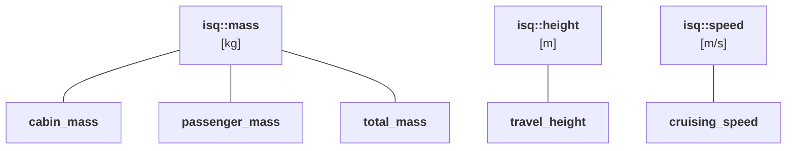
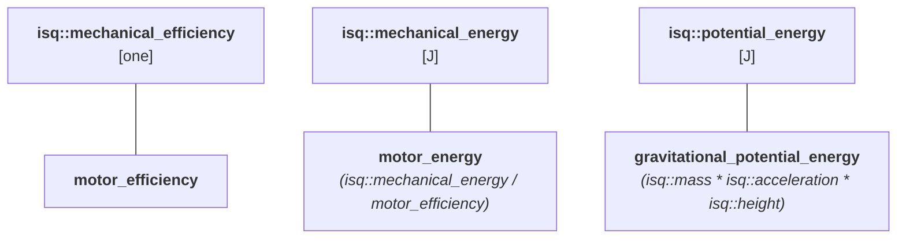

# Custom Quantity Specifications

While the ISQ (International System of Quantities) provides many standard quantity types,
real-world applications often require domain-specific distinctions between quantities that
share the same dimension. For example, in an elevator system, both _cabin mass_ and
_passenger mass_ are masses (kg), but treating them as interchangeable could lead to
incorrect calculations or unsafe designs.

This workshop teaches you how to define your own custom `quantity_spec` types to create
semantic distinctions within your domain. You'll learn to extend the ISQ hierarchy with
application-specific types that make APIs self-documenting and prevent subtle bugs at
compile time.


## Problem statement

Consider designing an elevator system. Engineers must calculate energy requirements
to size the motor properly:

- **Lifting energy** (potential): $E_p = m \cdot g \cdot h$
- **Acceleration energy** (kinetic): $E_k = \frac{1}{2} m v^2$
- **Mechanical energy**: $E_{mech} = E_p + E_k$
- **Motor input energy**: $E_{input} = E_{mech} / \eta$ (accounting for motor efficiency)

All these are energies measured in joules, but they represent different physical concepts:

- `gravitational_potential_energy` - energy stored by lifting mass against gravity
- `kinetic_energy` - energy of motion
- `mechanical_energy` - total mechanical work required
- `motor_energy` - actual energy the motor must provide (including losses)

!!! info "Why separate types matter?"

    Without distinct quantity specifications, the type system cannot prevent you from accidentally
    passing `kinetic_energy` where `gravitational_potential_energy` is expected, or using
    `mechanical_energy` directly in place of `motor_energy`. These are all energies with
    the same unit, but mixing them up leads to incorrect calculations.

**Well-defined conversion rules** ensure type safety while allowing valid operations:

- Adding two `gravitational_potential_energy` values is valid (same type)
- Adding `gravitational_potential_energy` + `kinetic_energy` → `mechanical_energy`
  (both are subtypes)
- Dividing `mechanical_energy` by `motor_efficiency` → `motor_energy` (equation-based conversion)
- Passing `motor_energy` where `kinetic_energy` is expected should fail at compile time

The same principle applies to masses: _cabin mass_, _passenger mass_, and _total mass_ are
all masses, but each has specific semantics that should be enforced by the type system.


## Your task

Complete the `qs` namespace by defining custom `quantity_spec` types following this
hierarchy:

<!-- TODO `total_mass` should be defined as `cabin_mass + passenger_mass` without the need for `quantity_cast` -->





!!! tip

    See
    [Hierarchies of Derived Quantities](../../users_guide/framework_basics/systems_of_quantities.md#hierarchies-of-derived-quantities)
    for more details.

The rest of the code is provided—your task is to properly define these quantity
specifications so the type system enforces semantic correctness.

```cpp
// ce-embed height=650 compiler=clang2110 flags="-std=c++23 -stdlib=libc++ -O3" mp-units=trunk
#include <mp-units/core.h>
#include <mp-units/systems/isq.h>
#include <mp-units/systems/si.h>
#include <iostream>

using namespace mp_units;
using namespace mp_units::si::unit_symbols;

namespace qs {

// TODO: Define custom quantity_spec types for:
// - cabin_mass
// - passenger_mass
// - total_mass
// - travel_height
// - cruising_speed
// - motor_efficiency
// - motor_energy
// - gravitational_potential_energy

}

struct elevator_trip {
  quantity<qs::cabin_mass[kg]> cabin_mass;
  quantity<qs::passenger_mass[kg]> passenger_load;
  quantity<qs::travel_height[m]> height;
  quantity<qs::cruising_speed[m/s]> speed;
  quantity<qs::motor_efficiency[one]> efficiency;
};

constexpr quantity<qs::total_mass[kg]> total_mass(quantity<qs::cabin_mass[kg]> cabin,
                                                  quantity<qs::passenger_mass[kg]> passengers)
{
  return quantity_cast<qs::total_mass>(cabin + passengers);
}

constexpr quantity<qs::gravitational_potential_energy[J]> lifting_energy(quantity<qs::total_mass[kg]> mass,
                                                                         quantity<qs::travel_height[m]> height)
{
  constexpr quantity g = isq::acceleration(1 * si::standard_gravity);
  return mass * g * height;
}

constexpr quantity<isq::kinetic_energy[J]> acceleration_energy(quantity<qs::total_mass[kg]> mass,
                                                               quantity<qs::cruising_speed[m/s]> speed)
{
  return 0.5 * mass * pow<2>(speed);
}

constexpr quantity<isq::mechanical_energy[J]> mechanical_energy(quantity<qs::gravitational_potential_energy[J]> ep,
                                                                quantity<isq::kinetic_energy[J]> ek)
{
  return ep + ek;
}

constexpr quantity<qs::motor_energy[J]> required_input_energy(quantity<isq::mechanical_energy[J]> e_mech,
                                                              quantity<qs::motor_efficiency[one]> efficiency)
{
  return qs::motor_energy(e_mech / efficiency);
}

int main()
{
  elevator_trip trip{
    .cabin_mass = 800.0 * kg,
    .passenger_load = 400.0 * kg,   // ~5 passengers
    .height = 30.0 * m,             // ~10 floors
    .speed = 2.5 * m / s,
    .efficiency = 0.85              // 85% efficient motor
  };

  auto m_total = total_mass(trip.cabin_mass, trip.passenger_load);
  auto E_lift = lifting_energy(m_total, trip.height);
  auto E_accel = acceleration_energy(m_total, trip.speed);
  auto E_mech = mechanical_energy(E_lift, E_accel);
  auto E_input = required_input_energy(E_mech, trip.efficiency);

  std::cout << "Elevator trip analysis:\n";
  std::cout << "- Cabin mass: " << trip.cabin_mass << '\n';
  std::cout << "- Passenger load: " << trip.passenger_load << '\n';
  std::cout << "- Total mass: " << m_total << '\n';
  std::cout << "- Travel height: " << trip.height << '\n';
  std::cout << "- Cruising speed: " << trip.speed << '\n';
  std::cout << "- Motor efficiency: " << trip.efficiency.in(percent) << "\n\n";

  std::cout << "Energy requirements:\n";
  std::cout << "- Lifting energy (potential): " << E_lift.in(kJ) << '\n';
  std::cout << "- Acceleration energy (kinetic): " << E_accel.in(kJ) << '\n';
  std::cout << "- Mechanical energy: " << E_mech.in(kJ) << '\n';
  std::cout << "- Required input energy: " << E_input.in(kJ) << "\n\n";

  auto trip_duration = trip.height / trip.speed;
  auto avg_power = E_input / trip_duration;
  std::cout << "Estimated trip duration: " << trip_duration.in(s) << '\n';
  std::cout << "Average power requirement: " << avg_power.in(kW) << '\n';
}
```

??? tip "Solution"

    ```cpp
    #include <mp-units/core.h>
    #include <mp-units/systems/isq.h>
    #include <mp-units/systems/si.h>
    #include <iostream>

    using namespace mp_units;
    using namespace mp_units::si::unit_symbols;

    namespace qs {

    inline constexpr struct cabin_mass final : quantity_spec<isq::mass> {} cabin_mass;
    inline constexpr struct passenger_mass final : quantity_spec<isq::mass> {} passenger_mass;
    inline constexpr struct total_mass final : quantity_spec<isq::mass> {} total_mass;
    inline constexpr struct travel_height final : quantity_spec<isq::height> {} travel_height;
    inline constexpr struct cruising_speed final : quantity_spec<isq::speed> {} cruising_speed;
    inline constexpr struct motor_efficiency final : quantity_spec<isq::mechanical_efficiency> {} motor_efficiency;
    inline constexpr struct motor_energy final : quantity_spec<isq::mechanical_energy, isq::mechanical_energy / motor_efficiency> {} motor_energy;
    inline constexpr struct gravitational_potential_energy final : quantity_spec<isq::potential_energy, isq::mass * isq::acceleration * isq::height> {} gravitational_potential_energy;

    }

    struct elevator_trip {
      quantity<qs::cabin_mass[kg]> cabin_mass;
      quantity<qs::passenger_mass[kg]> passenger_load;
      quantity<qs::travel_height[m]> height;
      quantity<qs::cruising_speed[m/s]> speed;
      quantity<qs::motor_efficiency[one]> efficiency;
    };

    constexpr quantity<qs::total_mass[kg]> total_mass(quantity<qs::cabin_mass[kg]> cabin,
                                                      quantity<qs::passenger_mass[kg]> passengers)
    {
      return quantity_cast<qs::total_mass>(cabin + passengers);
    }

    constexpr quantity<qs::gravitational_potential_energy[J]> lifting_energy(quantity<qs::total_mass[kg]> mass,
                                                                            quantity<qs::travel_height[m]> height)
    {
      constexpr quantity g = isq::acceleration(1 * si::standard_gravity);
      return mass * g * height;
    }

    constexpr quantity<isq::kinetic_energy[J]> acceleration_energy(quantity<qs::total_mass[kg]> mass,
                                                                  quantity<qs::cruising_speed[m/s]> speed)
    {
      return 0.5 * mass * pow<2>(speed);
    }

    constexpr quantity<isq::mechanical_energy[J]> mechanical_energy(quantity<qs::gravitational_potential_energy[J]> ep,
                                                                    quantity<isq::kinetic_energy[J]> ek)
    {
      return ep + ek;
    }

    constexpr quantity<qs::motor_energy[J]> required_input_energy(quantity<isq::mechanical_energy[J]> e_mech,
                                                                  quantity<qs::motor_efficiency[one]> efficiency)
    {
      return qs::motor_energy(e_mech / efficiency);
    }

    int main()
    {
      elevator_trip trip{
        .cabin_mass = 800.0 * kg,
        .passenger_load = 400.0 * kg,   // ~5 passengers
        .height = 30.0 * m,             // ~10 floors
        .speed = 2.5 * m / s,
        .efficiency = 0.85              // 85% efficient motor
      };

      // Calculate total mass and energy components
      auto m_total = total_mass(trip.cabin_mass, trip.passenger_load);
      auto E_lift = lifting_energy(m_total, trip.height);
      auto E_accel = acceleration_energy(m_total, trip.speed);
      auto E_mech = mechanical_energy(E_lift, E_accel);
      auto E_input = required_input_energy(E_mech, trip.efficiency);

      std::cout << "Elevator trip analysis:\n";
      std::cout << "- Cabin mass: " << trip.cabin_mass << '\n';
      std::cout << "- Passenger load: " << trip.passenger_load << '\n';
      std::cout << "- Total mass: " << m_total << '\n';
      std::cout << "- Travel height: " << trip.height << '\n';
      std::cout << "- Cruising speed: " << trip.speed << '\n';
      std::cout << "- Motor efficiency: " << trip.efficiency.in(percent) << "\n\n";

      std::cout << "Energy requirements:\n";
      std::cout << "- Lifting energy (potential): " << E_lift.in(kJ) << '\n';
      std::cout << "- Acceleration energy (kinetic): " << E_accel.in(kJ) << '\n';
      std::cout << "- Mechanical energy: " << E_mech.in(kJ) << '\n';
      std::cout << "- Required input energy: " << E_input.in(kJ) << "\n\n";

      // Practical information for motor sizing
      auto trip_duration = trip.height / trip.speed;  // simplified: assumes constant speed
      auto avg_power = E_input / trip_duration;
      std::cout << "Estimated trip duration: " << trip_duration.in(s) << '\n';
      std::cout << "Average power requirement: " << avg_power.in(kW) << '\n';
    }
    ```


??? abstract "What you learned?"

    ### Domain-specific quantity hierarchies

    Real-world applications often need to distinguish between quantities that share the
    same dimension but have different semantic meanings:

    ```cpp
    // All are masses (kg), but semantically different:
    inline constexpr struct cabin_mass final : quantity_spec<isq::mass> {} cabin_mass;
    inline constexpr struct passenger_mass final : quantity_spec<isq::mass> {} passenger_mass;
    inline constexpr struct total_mass final : quantity_spec<isq::mass> {} total_mass;

    quantity cabin = cabin_mass(800 * kg);
    quantity passengers = passenger_mass(400 * kg);
    quantity total = cabin + passengers;  // Compiles! Result type: isq::mass (common parent)
    ```

    Each custom `quantity_spec` extends the ISQ hierarchy with application-specific semantics.
    Adding different specs yields their common ancestor (`isq::mass` here), not a specific
    subtype like `total_mass`. Use `quantity_cast` for explicit semantic conversions.

    ### Equation-based quantity specifications

    Some quantities are defined by their physical relationships:

    ```cpp
    // Gravitational potential energy: E_p = m * g * h
    inline constexpr struct gravitational_potential_energy final :
      quantity_spec<isq::mass * isq::acceleration * isq::height> {} gravitational_potential_energy;

    // Type-checked dimensional analysis!
    quantity energy =
      gravitational_potential_energy(total_mass(1200 * kg) * isq::acceleration(1 * si::standard_gravity) * travel_height(30 * m));
    ```

    The equation form `mass * acceleration * height`:

    - Makes the physics explicit in the type system
    - Ensures correct ingredients are used in calculations
    - Provides compile-time validation of dimensional correctness

    ### Type-safe conversions in quantity hierarchies

    Different `quantity_spec` types have controlled conversion rules:

    ```cpp
    // ✅ Allowed: Adding subtypes yields common parent
    quantity ep = gravitational_potential_energy(/* ... */);
    quantity ek = isq::kinetic_energy(/* ... */);
    quantity total = ep + ek;  // Result: isq::mechanical_energy (common parent)

    // ✅ Allowed: Derived specifications from equations
    quantity motor_input = qs::motor_energy(e_mech / efficiency);

    // ❌ Prevented: Wrong quantity type at compile time
    void process_kinetic(QuantityOf<isq::kinetic_energy> auto ek);
    process_kinetic(ep);  // Does not compile! Gravitational ≠ kinetic
    ```

    **Hierarchy rules:**

    - Quantities of the same kind tree can be added/subtracted and compared
    - Addition/subtraction of quantities yields their common ancestor
    - Equation-based specs enforce their defining relationships
    - Incompatible specs prevent accidental mixing at compile time

    ### Using `quantity_cast` for explicit conversions

    When you need to explicitly combine different subtypes:

    ```cpp
    constexpr quantity<qs::total_mass[kg]> total_mass(quantity<qs::cabin_mass[kg]> cabin,
                                                      quantity<qs::passenger_mass[kg]> passengers)
    {
      return quantity_cast<qs::total_mass>(cabin + passengers);
    }
    ```

    `quantity_cast<TargetSpec>(q)` explicitly converts between specs from the same
    hierarchy tree:

    - Useful when the result should have a specific semantic type
    - Provides documentation of the intended conversion
    - Still type-safe—won't allow incompatible conversions (e.g., to quantities of
      other dimensions)

    ### Benefits for engineering applications

    **Self-documenting APIs:**

    ```cpp
    // Clear what each parameter represents:
    constexpr quantity<qs::gravitational_potential_energy[J]> lifting_energy(quantity<qs::total_mass[kg]> mass,
                                                                             quantity<qs::travel_height[m]> height);

    constexpr quantity<qs::motor_energy[J]> required_input_energy(quantity<isq::mechanical_energy[J]> e_mech,
                                                                  quantity<qs::motor_efficiency[one]> efficiency);
    ```

    **Compile-time error prevention:**

    ```cpp
    // ❌ Prevented at compile time:
    auto wrong = lifting_energy(passengers, cabin);        // Wrong mass type!
    auto bad = required_input_energy(E_lift, trip.speed);  // Wrong energy type!

    // ✅ Correct code is enforced:
    auto correct = lifting_energy(m_total, trip.height);   // Types match!
    ```


## References

- [User's Guide: Systems of Quantities](../../users_guide/framework_basics/systems_of_quantities.md)
- [Quantity Hierarchies](../../reference/systems_reference/hierarchies/index.md)


## Takeaways

- **Semantic typing**: Custom `quantity_spec` types distinguish between semantically
  different quantities that share the same dimension (_mass_, _energy_, etc.)
- **Compile-time safety**: The type system prevents mixing up _cabin mass_ with
  _total mass_, or _gravitational potential energy_ with generic _energy_
- **Self-documenting APIs**: Function signatures clearly communicate what kind of
  quantity each parameter expects
- **Equation-based specifications**: Using equation forms like
  `isq::mass * isq::acceleration * isq::height` for `gravitational_potential_energy`
  makes the physics explicit in the type system and requires correct ingredients
  to be used in a quantity equation to get the desired outcome
- **Practical applications**: Valuable in motor sizing (cabin/passenger/total mass),
  energy calculations (potential, kinetic, mechanical, input), structural analysis
  (live load, dead load, total load), and thermal systems (sensible heat, latent heat,
  total heat), where mixing up semantically different quantities could lead to incorrect
  or unsafe designs
